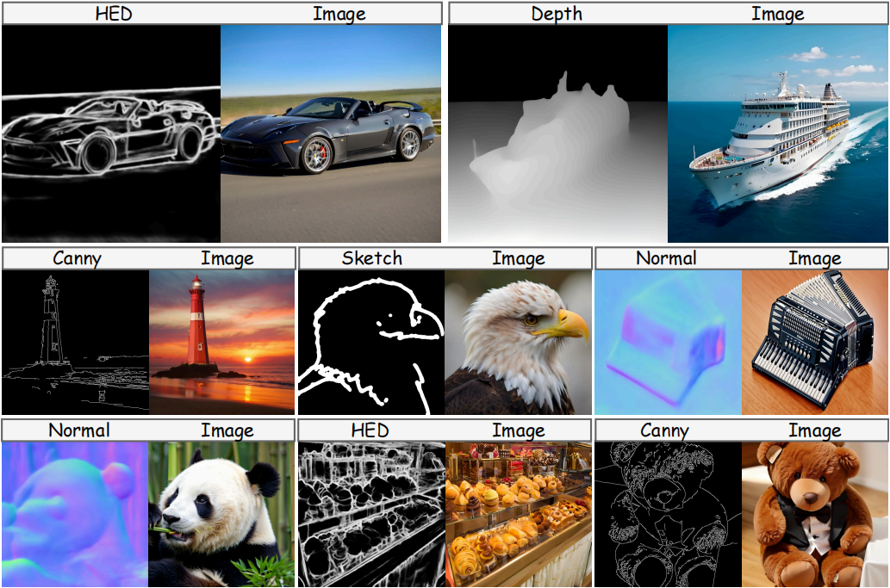

<h1> CAR: Controllable AutoRegressive Modeling for Visual Generation </h1>

Ziyu Yao1,2, Jialin Li2, Yifeng Zhou2, Yong Liu2, Xi Jiang2,3, Chengjie Wang2, Feng Zheng3, Yuexian Zou1, Lei Li4

1 Peking University,
2 Tencent Youtu Lab,
3 Southern University of Science and Technology,
4 University of Washington

&nbsp;

